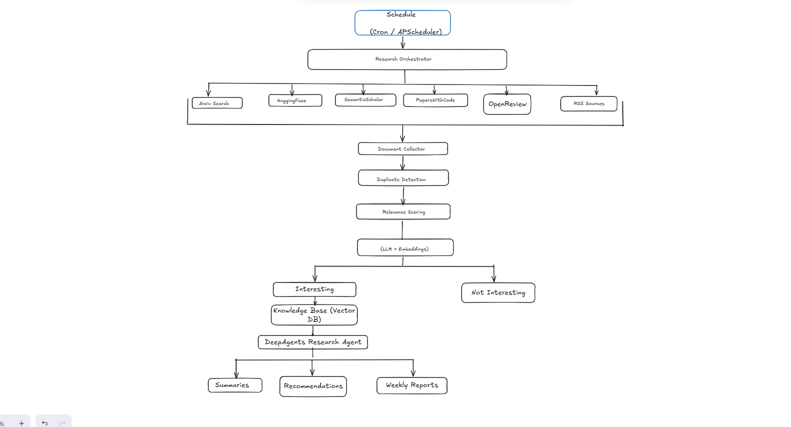

# Agents papers research 

O Agents papers research é um Research Intelligence System com o propósito de pesquisar por você,
ranquear, verificar duplicação e resumir papers acadêmicos dentro da área de Machine Learning, Além disso,
ele faz um sumário dos papers mais  importante e faz um relatório semanal. Assim, você pode configurar para que ele 
possa executar em um determinado dia do mês.

## Arquitetura do projeto 

A arquitetura do projeto foi desenhada como se segue na imagem abaixo, o objetivo foi deixar tudo que é considerado
Determístico de fora do escopo do agente proprieamente dito, por exemplo, existem API's que podemos chamar, na qual
Retornam os papers para nós, então, não é necessário usar agentes aplicados a essa tarefa, esse princípio é conhecido
como **Principle of Least Agency**

Assim, podemos ver que os agentes atuam de fato, na seção de sumário, recomendações e reportes mensais.



```
  research-agent
     ├─App/
       ├─ api/
       ├─ Collectors/
       ├─ config/
       ├─ database/
       ├─ embeddings/
       ├─ llm/
       ├─ models
       ├─ planner/
       ├─ reports/
       ├─ scheduler/
       ├─ skills/
     ├─config/
```

## O que foi implementado
| Módulo                   | status      |
|--------------------------|-------------|
| Arxiv Search             | X funcional |
| SemanticSchola           | X funcional |
| PapersWithCode           | X funcional       |
| Official Blogs           |     X funcional        |
| OpenReview               |     X funcional        |
| Document Collector       |      X funcional       |
| Duplicate Detection      |     X funcional        |
| Relevance Scoring <br/>  (LLM + Embeddings) |    X funcional         |
| Knowledge Base (Vector DB)     |        X funcional     |
| Summaries |          X funcional   |
| Recommendations    |      X funcional       |
| Weekly Reports    |      X funcional       |


